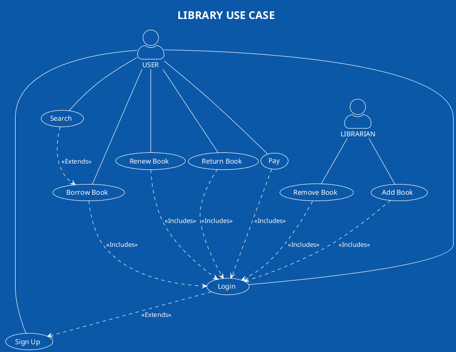

```plantuml

@startuml

!theme amiga
skinparam actorStyle awesome
title LIBRARY USE CASE

:USER: as user
( Login ) as login
(Sign Up) as signUp
(Search) as search
(Borrow Book) as borrowBook
(Renew Book) as renewBook
(Return Book) as returnBook
(Pay) as pay

:LIBRARIAN: as librarian
(Add Book) as addBook
(Remove Book) as removeBook

user -- signUp
user -- login
user -- search
user -- borrowBook
user -- renewBook
user -- returnBook
user -- pay

search ..> borrowBook : <<Extends>>
login ..> signUp : <<Extends>>

borrowBook ...> login : <<Includes>>
renewBook ...> login : <<Includes>>
returnBook ...> login : <<Includes>>
pay ...> login : <<Includes>>

librarian -- addBook
librarian -- removeBook

addBook ...> login : <<Includes>>
removeBook ...> login : <<Includes>>

@enduml

```
