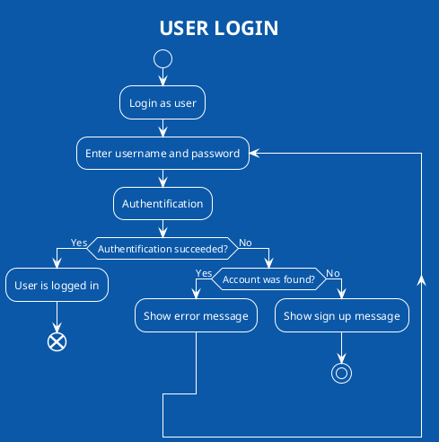
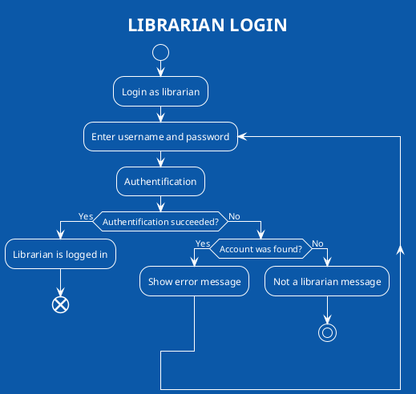
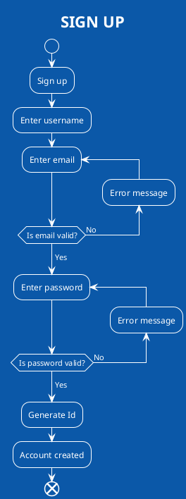
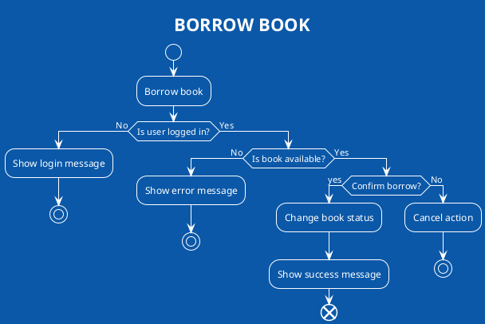
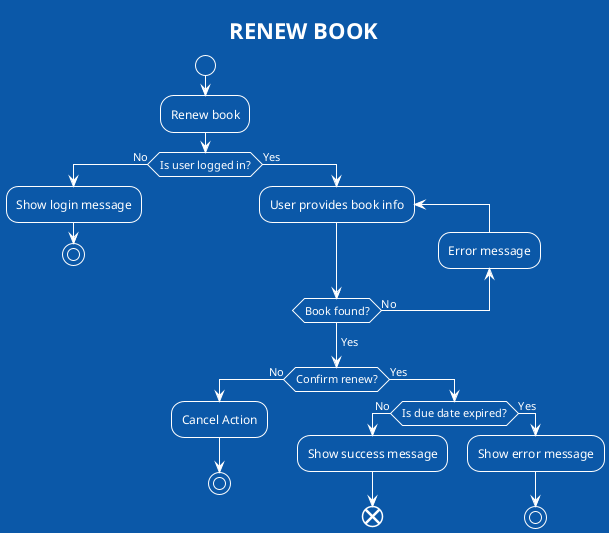
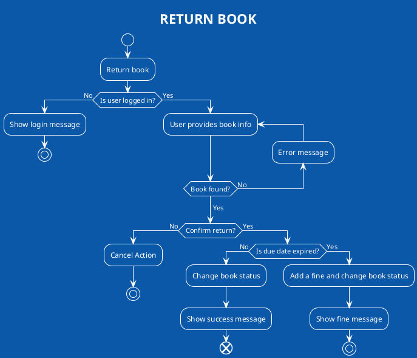
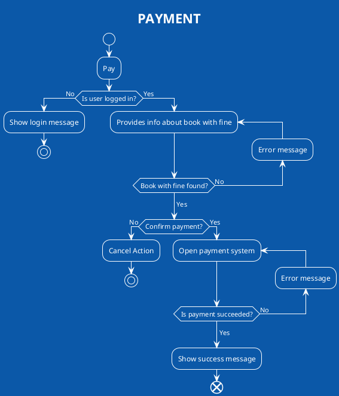

```plantuml

@startuml

!theme amiga
title USER LOGIN

start
:Login as user;
repeat:Enter username and password;
:Authentification;
if(Authentification succeeded?) then (Yes)
:User is logged in;
end
else (No)
if (Account was found?) then (Yes)
:Show error message;
else (No)
:Show sign up message;
stop

@enduml

```

```plantuml

@startuml

!theme amiga
title LIBRARIAN LOGIN


start
:Login as librarian;
repeat:Enter username and password;
:Authentification;
if(Authentification succeeded?) then (Yes)
:Librarian is logged in;
end
else (No)
if (Account was found?) then (Yes)
:Show error message;
else (No)
:Not a librarian message;
stop

@enduml

```

```plantuml

@startuml

!theme amiga
title SIGN UP

start
:Sign up;
:Enter username;
repeat:Enter email;
backward:Error message;
repeat while (Is email valid?) is (No)
->Yes;
repeat:Enter password;
backward:Error message;
repeat while (Is password valid?) is (No)
->Yes;
:Generate Id;
:Account created;
end

@enduml

```

```plantuml

@startuml

!theme amiga
title BORROW BOOK

start
:Borrow book;
if (Is user logged in?) then (No)
:Show login message;
stop
else (Yes)
if (Is book available?) then (No)
:Show error message;
stop
else (Yes)
if (Confirm borrow?) then (yes)
:Change book status;
:Show success message;
end
else (No)
:Cancel action;
stop

@enduml

```

```plantuml

@startuml

!theme amiga
title RENEW BOOK

start
:Renew book;
if (Is user logged in?) then (No)
:Show login message;
stop
else (Yes)
repeat:User provides book info;
backward:Error message;
repeat while (Book found?) is (No)
->Yes;
if (Confirm renew?) then (No)
:Cancel Action;
stop
else (Yes)
if (Is due date expired?) then (No)
:Show success message;
end
else (Yes)
:Show error message;
stop

@enduml

```

```plantuml

@startuml

!theme amiga
title RETURN BOOK

start
:Return book;
if (Is user logged in?) then (No)
:Show login message;
stop
else (Yes)
repeat:User provides book info;
backward:Error message;
repeat while (Book found?) is (No)
->Yes;
if (Confirm return?) then (No)
:Cancel Action;
stop
else (Yes)
if (Is due date expired?) then (No)
:Change book status;
:Show success message;
end
else (Yes)
:Add a fine and change book status;
:Show fine message;
stop

@enduml

```

```plantuml

@startuml

!theme amiga
title PAYMENT

start
:Pay;
if (Is user logged in?) then (No)
:Show login message;
stop
else (Yes)
repeat:Provides info about book with fine;
backward:Error message;
repeat while (Book with fine found?) is (No)
->Yes;
if (Confirm payment?) then (No)
:Cancel Action;
stop
else (Yes)
repeat:Open payment system;
backward:Error message;
repeat while (Is payment succeeded?) is (No)
->Yes;
:Show success message;
end

@enduml

```
