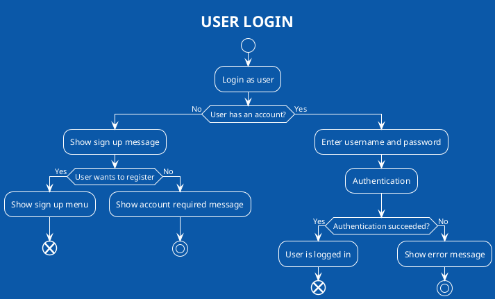
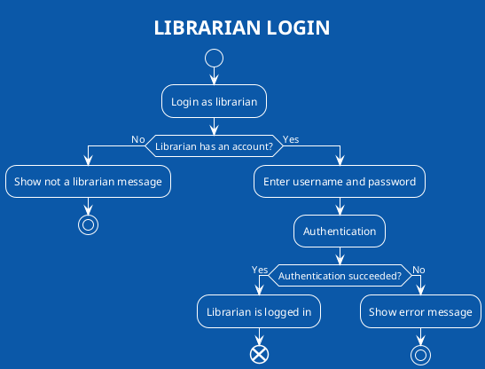
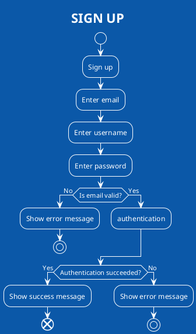
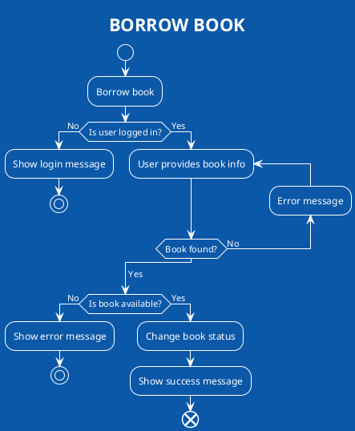
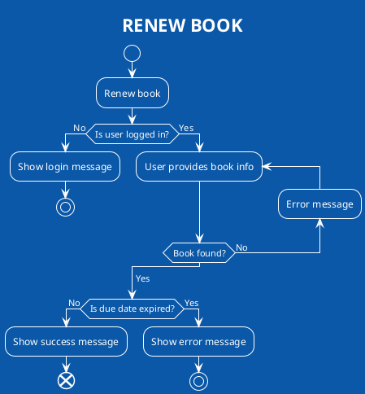
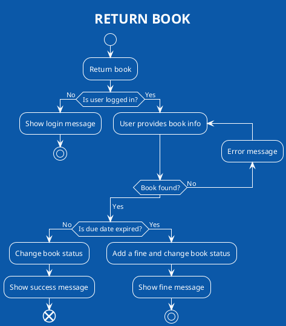
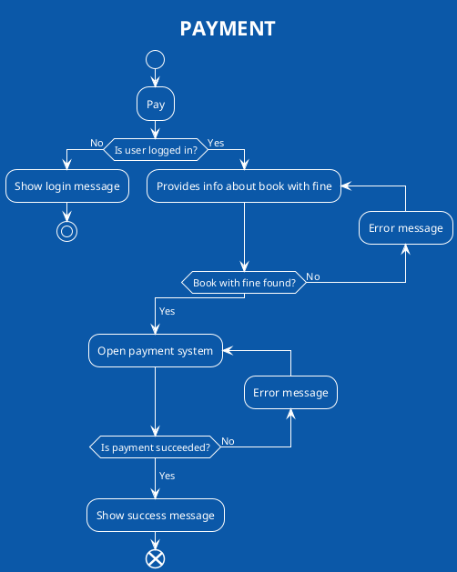

```plantuml

@startuml

!theme amiga
title USER LOGIN

start
:Login as user;
if (User has an account?) then (No)
    :Show sign up message;
        if (User wants to register) then (Yes)
            :Show sign up menu;
            end
        else (No)
            :Show account required message;
            stop
        endif
else (Yes)
    :Enter username and password;
    :Authentication;
    if(Authentication succeeded?) then (Yes)
        :User is logged in;
        end
    else (No)
        :Show error message;
        stop
    endif
endif

@enduml

```

```plantuml

@startuml

!theme amiga
title LIBRARIAN LOGIN


start
:Login as librarian;
if (Librarian has an account?) then (No)
    :Show not a librarian message;
    stop
else (Yes)
    :Enter username and password;
    :Authentication;
    if(Authentication succeeded?) then (Yes)
        :Librarian is logged in;
        end
    else (No)
        :Show error message;
        stop
    endif
endif

@enduml

```

```plantuml

@startuml

!theme amiga
title SIGN UP

start
:Sign up;
:Enter email;
:Enter username;
:Enter password;
if (Is email valid?) then (No)
    :Show error message;
    stop
else (Yes)
    :authentication;
endif
if (Authentication succeeded?) then (Yes)
    :Show success message;
    end
else (No)
    :Show error message;
    stop
endif

@enduml

```

```plantuml

@startuml

!theme amiga
title BORROW BOOK

start
:Borrow book;
if (Is user logged in?) then (No)
    :Show login message;
    stop
else (Yes)
    repeat:User provides book info;
    backward:Error message;
    repeat while (Book found?) is (No)
endif
->Yes;
if (Is book available?) then (No)
    :Show error message;
    stop
else (Yes)
    :Change book status;
    :Show success message;
    end
endif

@enduml

```

```plantuml

@startuml

!theme amiga
title RENEW BOOK

start
:Renew book;
if (Is user logged in?) then (No)
    :Show login message;
    stop
else (Yes)
    repeat:User provides book info;
    backward:Error message;
    repeat while (Book found?) is (No)
endif
->Yes;
if (Is due date expired?) then (No)
    :Show success message;
    end
else (Yes)
    :Show error message;
    stop
endif

@enduml

```

```plantuml

@startuml

!theme amiga
title RETURN BOOK

start
:Return book;
if (Is user logged in?) then (No)
    :Show login message;
    stop
else (Yes)
    repeat:User provides book info;
    backward:Error message;
    repeat while (Book found?) is (No)
endif
->Yes;
if (Is due date expired?) then (No)
    :Change book status;
    :Show success message;
    end
else (Yes)
    :Add a fine and change book status;
    :Show fine message;
    stop
endif

@enduml

```

```plantuml

@startuml

!theme amiga
title PAYMENT

start
:Pay;
if (Is user logged in?) then (No)
    :Show login message;
    stop
else (Yes)
    repeat:Provides info about book with fine;
    backward:Error message;
    repeat while (Book with fine found?) is (No)
endif
->Yes;
repeat:Open payment system;
backward:Error message;
repeat while (Is payment succeeded?) is (No)
->Yes;
:Show success message;
end

@enduml

```
