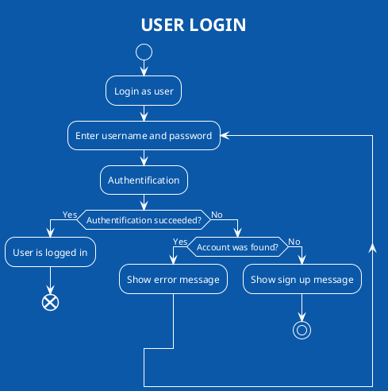
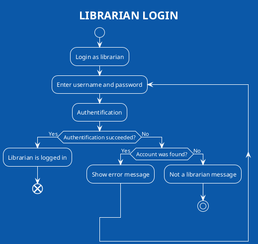
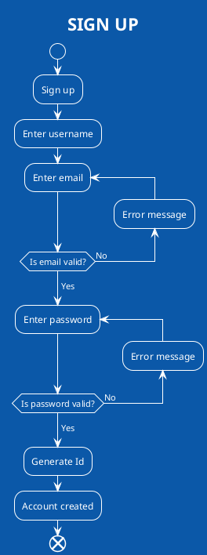
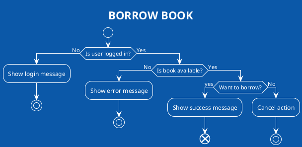
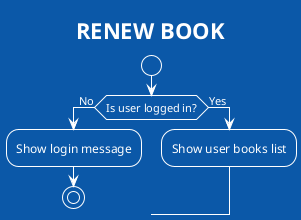

```plantuml

@startuml

!theme amiga
title USER LOGIN

start
:Login as user;
repeat :Enter username and password;
:Authentification;
if(Authentification succeeded?) then (Yes)
:User is logged in;
end
else (No)
if (Account was found?) then (Yes)
:Show error message;
else (No)
:Show sign up message;
stop

@enduml

```

```plantuml

@startuml

!theme amiga
title LIBRARIAN LOGIN


start
:Login as librarian;
repeat :Enter username and password;
:Authentification;
if(Authentification succeeded?) then (Yes)
:Librarian is logged in;
end
else (No)
if (Account was found?) then (Yes)
:Show error message;
else (No)
:Not a librarian message;
stop

@enduml

```

```plantuml

@startuml

!theme amiga
title SIGN UP

start
:Sign up;
:Enter username;
repeat :Enter email;
backward :Error message;
repeat while (Is email valid?) is (No)
->Yes;
repeat :Enter password;
backward :Error message;
repeat while (Is password valid?) is (No)
->Yes;
:Generate Id;
:Account created;
end

@enduml

```

```plantuml

@startuml

!theme amiga
title BORROW BOOK

start
if (Is user logged in?) then (No)
:Show login message;
stop
else (Yes)
if (Is book available?) then (No)
:Show error message;
stop
else (Yes)
if (Want to borrow?) then (yes)
:Show success message;
end
else (No)
:Cancel action;
stop

@enduml

```

```plantuml

@startuml

!theme amiga
title RENEW BOOK

start
if (Is user logged in?) then (No)
:Show login message;
stop
else (Yes)
:Show user books list;

@enduml

```
