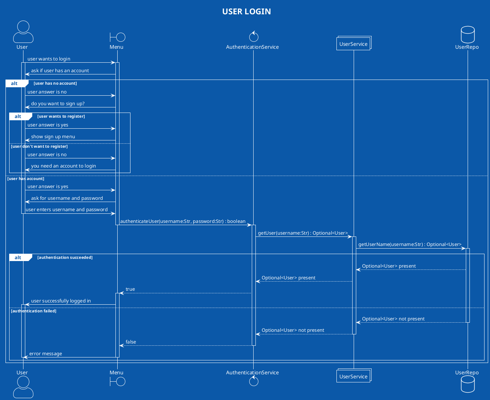
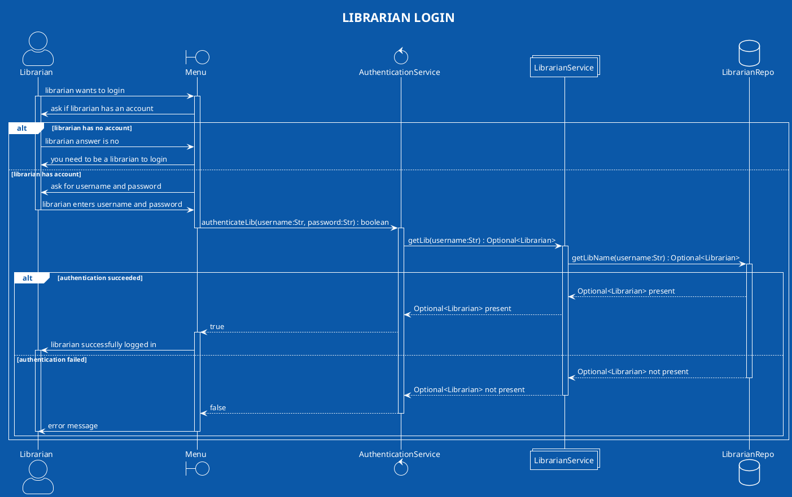

```plantuml

@startuml

!theme amiga
skinparam actorStyle awesome
title USER LOGIN

Actor User as user
Boundary Menu as menu
Control AuthenticationService as service
collections UserService as userservice
database UserRepo as repo


user -> menu : user wants to login
activate user
activate menu
menu -> user : ask if user has an account
alt user has no account
    user -> menu : user answer is no
    menu -> user : do you want to sign up?
    alt user wants to register
        user -> menu : user answer is yes
        menu -> user : show sign up menu
    else user don't want to register
        user -> menu : user answer is no
        menu -> user : you need an account to login
    end
else user has account
    user -> menu : user answer is yes
    menu -> user : ask for username and password
    user -> menu : user enters username and password
    deactivate user
    menu -> service : authenticateUser(username:Str, password:Str) : boolean
    deactivate menu
    activate service
    service -> userservice : getUser(username:Str) : Optional<User>
    activate userservice
    userservice -> repo : getUserName(username:Str) : Optional<User>
    activate repo
    alt authentication succeeded
        repo --> userservice :  Optional<User> present
        userservice --> service :  Optional<User> present
        service --> menu : true
        activate menu
        menu -> user : user successfully logged in
        activate user
    else authentication failed
        repo --> userservice : Optional<User> not present
        deactivate repo
        userservice --> service :  Optional<User> not present
        deactivate userservice
        service --> menu : false
        deactivate service
        menu -> user : error message
        deactivate user
        deactivate menu
    end
end

@enduml

```

```plantuml

@startuml

!theme amiga
skinparam actorStyle awesome
title LIBRARIAN LOGIN

Actor Librarian as lib
Boundary Menu as menu
Control AuthenticationService as service
collections LibrarianService as libservice
database LibrarianRepo as repo

lib -> menu : librarian wants to login
activate lib
activate menu
menu -> lib : ask if librarian has an account
alt librarian has no account
    lib -> menu : librarian answer is no
    menu -> lib : you need to be a librarian to login
else librarian has account
    menu -> lib : ask for username and password
    lib -> menu : librarian enters username and password
    deactivate lib
    menu -> service : authenticateLib(username:Str, password:Str) : boolean
    deactivate menu
    activate service
    service -> libservice : getLib(username:Str) : Optional<Librarian>
    activate libservice
    libservice -> repo : getLibName(username:Str) : Optional<Librarian>
    activate repo
    alt authentication succeeded
        repo --> libservice :  Optional<Librarian> present
        libservice --> service :  Optional<Librarian> present
        service --> menu : true
        activate menu
        menu -> lib : librarian successfully logged in
        activate lib
    else authentication failed
        repo --> libservice : Optional<Librarian> not present
        deactivate repo
        libservice --> service :  Optional<Librarian> not present
        deactivate libservice
        service --> menu : false
        deactivate service
        menu -> lib : error message
        deactivate lib
        deactivate menu
    end
end

@enduml

```

```plantuml

@startuml

!theme amiga
skinparam actorStyle awesome
title SIGN UP


@enduml

```

```plantuml

@startuml

!theme amiga
skinparam actorStyle awesome
title BORROW BOOK


@enduml

```

```plantuml

@startuml

!theme amiga
skinparam actorStyle awesome
title RENEW BOOK


@enduml

```

```plantuml

@startuml

!theme amiga
skinparam actorStyle awesome
title RETURN BOOK


@enduml

```

```plantuml

@startuml

!theme amiga
skinparam actorStyle awesome
title PAYMENT


@enduml

```
