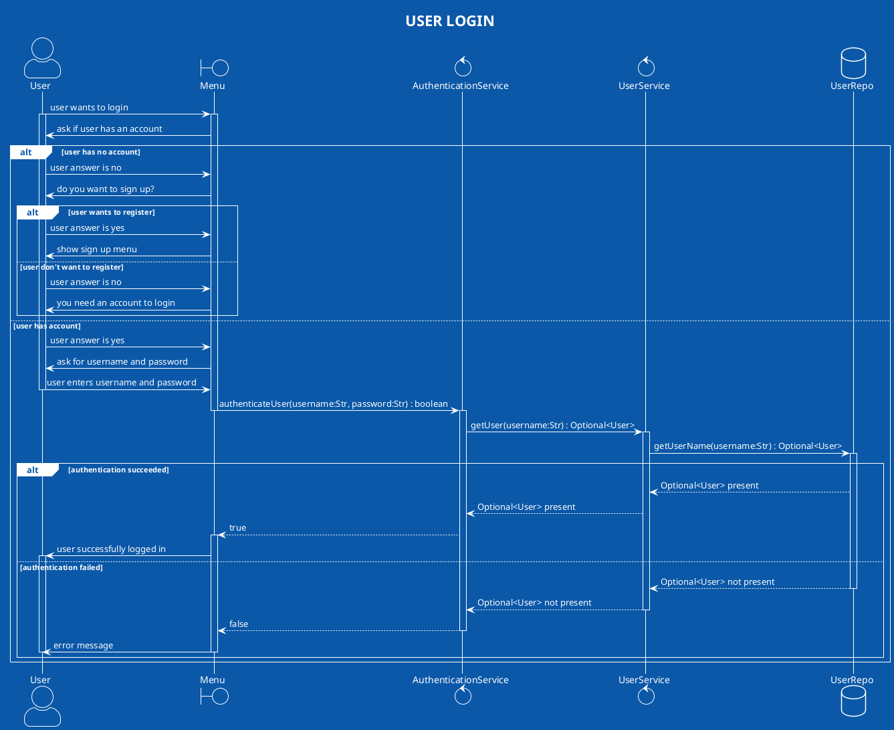
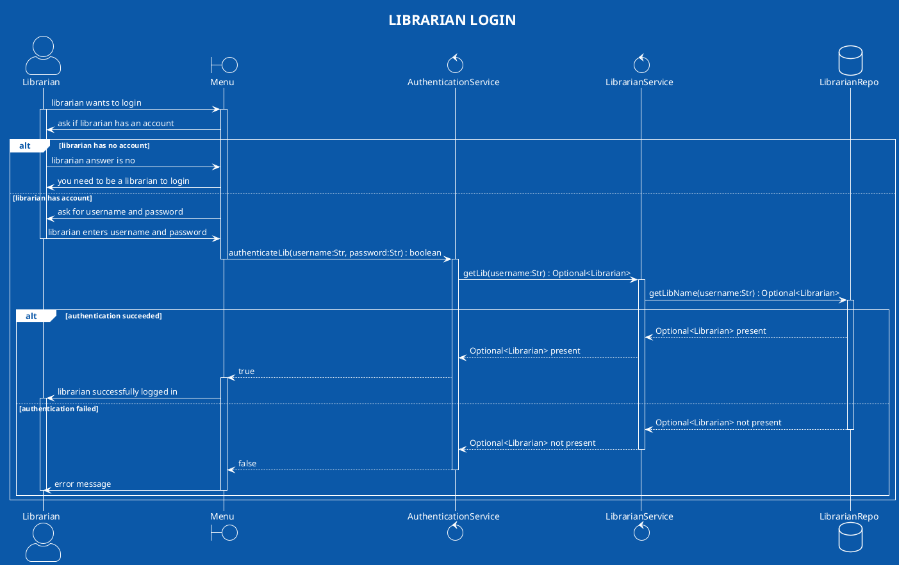
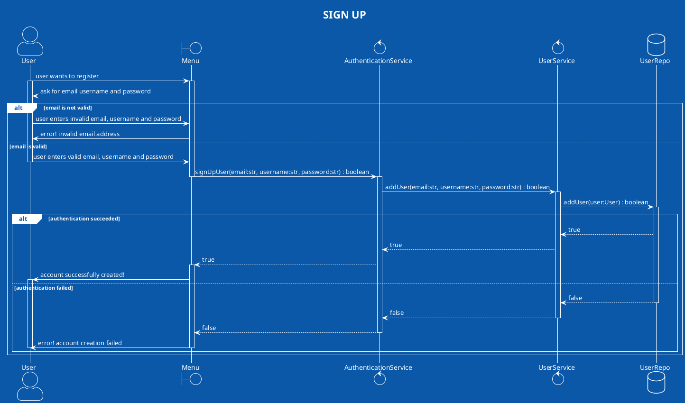
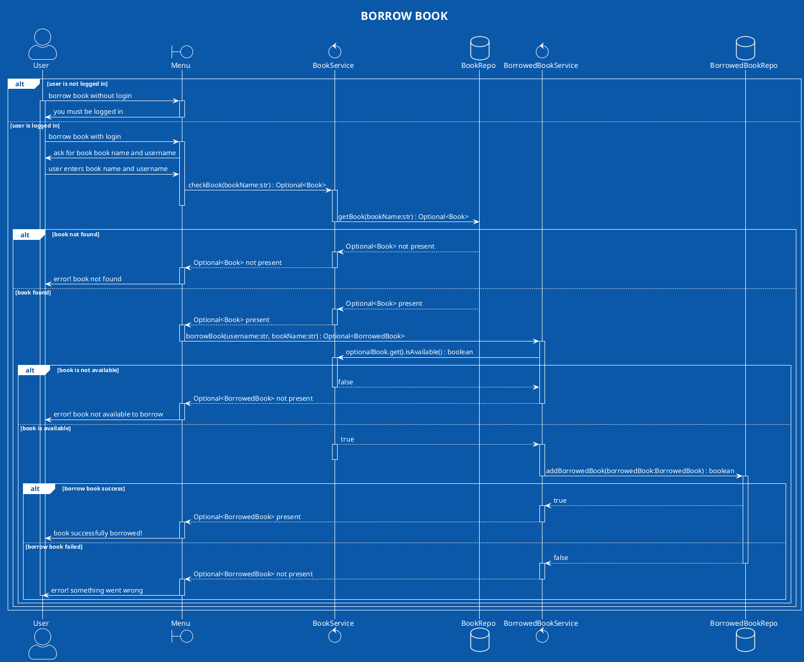
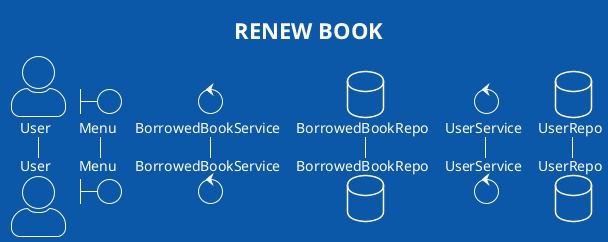

```plantuml

@startuml

!theme amiga
skinparam actorStyle awesome
title USER LOGIN

Actor User as user
Boundary Menu as menu
Control AuthenticationService as authservice
Control UserService as userservice
Database UserRepo as repo


user -> menu : user wants to login
activate user
activate menu
menu -> user : ask if user has an account
alt user has no account
    user -> menu : user answer is no
    menu -> user : do you want to sign up?
    alt user wants to register
        user -> menu : user answer is yes
        menu -> user : show sign up menu
    else user don't want to register
        user -> menu : user answer is no
        menu -> user : you need an account to login
    end
else user has account
    user -> menu : user answer is yes
    menu -> user : ask for username and password
    user -> menu : user enters username and password
    deactivate user
    menu -> authservice : authenticateUser(username:Str, password:Str) : boolean
    deactivate menu
    activate authservice
    authservice -> userservice : getUser(username:Str) : Optional<User>
    activate userservice
    userservice -> repo : getUserName(username:Str) : Optional<User>
    activate repo
    alt authentication succeeded
        repo --> userservice :  Optional<User> present
        userservice --> authservice :  Optional<User> present
        authservice --> menu : true
        activate menu
        menu -> user : user successfully logged in
        activate user
    else authentication failed
        repo --> userservice : Optional<User> not present
        deactivate repo
        userservice --> authservice :  Optional<User> not present
        deactivate userservice
        authservice --> menu : false
        deactivate authservice
        menu -> user : error message
        deactivate user
        deactivate menu
    end
end

@enduml

```

```plantuml

@startuml

!theme amiga
skinparam actorStyle awesome
title LIBRARIAN LOGIN

Actor Librarian as lib
Boundary Menu as menu
Control AuthenticationService as authservice
Control LibrarianService as libservice
Database LibrarianRepo as repo

lib -> menu : librarian wants to login
activate lib
activate menu
menu -> lib : ask if librarian has an account
alt librarian has no account
    lib -> menu : librarian answer is no
    menu -> lib : you need to be a librarian to login
else librarian has account
    menu -> lib : ask for username and password
    lib -> menu : librarian enters username and password
    deactivate lib
    menu -> authservice : authenticateLib(username:Str, password:Str) : boolean
    deactivate menu
    activate authservice
    authservice -> libservice : getLib(username:Str) : Optional<Librarian>
    activate libservice
    libservice -> repo : getLibName(username:Str) : Optional<Librarian>
    activate repo
    alt authentication succeeded
        repo --> libservice :  Optional<Librarian> present
        libservice --> authservice :  Optional<Librarian> present
        authservice --> menu : true
        activate menu
        menu -> lib : librarian successfully logged in
        activate lib
    else authentication failed
        repo --> libservice : Optional<Librarian> not present
        deactivate repo
        libservice --> authservice :  Optional<Librarian> not present
        deactivate libservice
        authservice --> menu : false
        deactivate authservice
        menu -> lib : error message
        deactivate lib
        deactivate menu
    end
end

@enduml

```

```plantuml

@startuml

!theme amiga
skinparam actorStyle awesome
title SIGN UP

Actor User as user
Boundary Menu as menu
Control AuthenticationService as authservice
Control UserService as userservice
Database UserRepo as repo

user -> menu : user wants to register
activate user
activate menu
menu -> user : ask for email username and password
alt email is not valid
    user -> menu : user enters invalid email, username and password
    menu -> user : error! invalid email address
else email is valid
    user -> menu : user enters valid email, username and password
    deactivate user
    menu -> authservice : signUpUser(email:str, username:str, password:str) : boolean
    deactivate menu
    activate authservice
    authservice -> userservice : addUser(email:str, username:str, password:str) : boolean
    activate userservice
    userservice -> repo : addUser(user:User) : boolean
    activate repo
    alt authentication succeeded
        repo --> userservice : true
        userservice --> authservice : true
        authservice --> menu : true
        activate menu
        menu -> user : account successfully created!
        activate user
    else authentication failed
        repo --> userservice : false
        deactivate repo
        userservice --> authservice : false
        deactivate userservice
        authservice --> menu : false
        deactivate authservice
        menu -> user : error! account creation failed
        deactivate menu
        deactivate user
    end
end

@enduml

```

```plantuml

@startuml

!theme amiga
skinparam actorStyle awesome
title BORROW BOOK

Actor User as user
Boundary Menu as menu
Control BookService as bservice
Database BookRepo as brepo
Control BorrowedBookService as bbservice
Database BorrowedBookRepo as bbrepo

alt user is not logged in
    user -> menu : borrow book without login
    activate user
    activate menu
    menu -> user : you must be logged in
    deactivate menu
else user is logged in
    user -> menu : borrow book with login
    activate menu
    menu -> user : ask for book book name and username
    user -> menu : user enters book name and username
    menu -> bservice : checkBook(bookName:str) : Optional<Book>
    activate bservice
    deactivate menu
    bservice -> brepo : getBook(bookName:str) : Optional<Book>
        deactivate bservice
    alt book not found
        brepo --> bservice : Optional<Book> not present
        activate bservice
        bservice --> menu : Optional<Book> not present
        deactivate bservice
        activate menu
        menu -> user : error! book not found
        deactivate menu
    else book found
        brepo --> bservice : Optional<Book> present
        activate bservice
        bservice --> menu : Optional<Book> present
        deactivate bservice
        activate menu
        menu -> bbservice : borrowBook(username:str, bookName:str) : Optional<BorrowedBook>
        deactivate menu
        activate bbservice
        bbservice -> bservice : optionalBook.get().isAvailable() : boolean
        activate bservice
        alt book is not available
            bservice --> bbservice : false
            deactivate bservice
            bbservice --> menu : Optional<BorrowedBook> not present
            deactivate bbservice
            activate menu
            menu -> user : error! book not available to borrow
            deactivate menu
        else book is available
            bservice --> bbservice : true
            activate bservice
            deactivate bservice
            activate bbservice
            bbservice -> bbrepo : addBorrowedBook(borrowedBook:BorrowedBook) : boolean
            deactivate bbservice
            activate bbrepo
            deactivate bbservice
            alt borrow book success
                bbrepo --> bbservice : true
                activate bbservice
                bbservice --> menu : Optional<BorrowedBook> present
                deactivate
                activate menu
                menu -> user : book successfully borrowed!
                deactivate menu
            else borrow book failed
                bbrepo --> bbservice : false
                deactivate bbrepo
                activate bbservice
                bbservice --> menu : Optional<BorrowedBook> not present
                deactivate
                activate menu
                menu -> user : error! something went wrong
                deactivate menu
                deactivate user
            end
        end
    end
end

@enduml

```

```plantuml

@startuml

!theme amiga
skinparam actorStyle awesome
title RENEW BOOK

Actor User as user
Boundary Menu as menu
Control BorrowedBookService as bbservice
Database BorrowedBookRepo as bbrepo
Control UserService as uservice
Database UserRepo as urepo


@enduml

```

```plantuml

@startuml

!theme amiga
skinparam actorStyle awesome
title RETURN BOOK


@enduml

```

```plantuml

@startuml

!theme amiga
skinparam actorStyle awesome
title PAYMENT


@enduml

```
