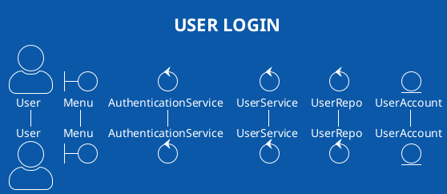

```plantuml

@startuml

!theme amiga
skinparam actorStyle awesome
title USER LOGIN

Actor User as user
Boundary Menu as menu
Control AuthenticationService as service
Control UserService as userservice
Control UserRepo as repository
Entity UserAccount as useraccount

@enduml

```

```plantuml

@startuml

!theme amiga
title LIBRARIAN LOGIN


@enduml

```

```plantuml

@startuml

!theme amiga
title SIGN UP


@enduml

```

```plantuml

@startuml

!theme amiga
title BORROW BOOK


@enduml

```

```plantuml

@startuml

!theme amiga
title RENEW BOOK


@enduml

```

```plantuml

@startuml

!theme amiga
title RETURN BOOK


@enduml

```

```plantuml

@startuml

!theme amiga
title PAYMENT


@enduml

```
