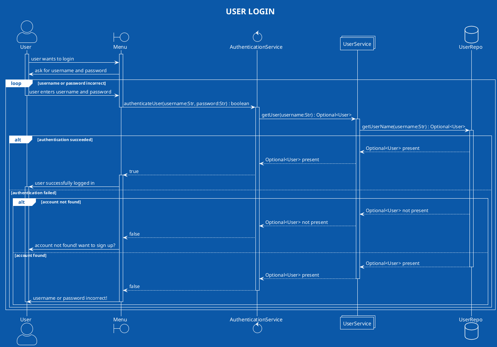
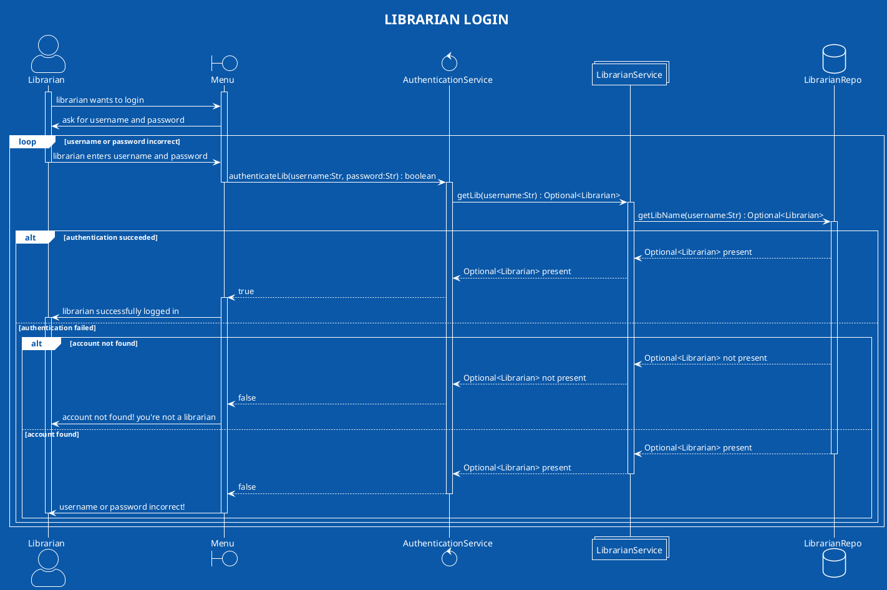

```plantuml

@startuml

!theme amiga
skinparam actorStyle awesome
title USER LOGIN

Actor User as user
Boundary Menu as menu
Control AuthenticationService as service
collections UserService as userservice
database UserRepo as repo

activate user
activate menu

user -> menu : user wants to login
menu -> user : ask for username and password

loop username or password incorrect
    user -> menu : user enters username and password
    deactivate user
    menu -> service : authenticateUser(username:Str, password:Str) : boolean
    deactivate menu
    activate service
    service -> userservice : getUser(username:Str) : Optional<User>
    activate userservice
    userservice -> repo : getUserName(username:Str) : Optional<User>
    activate repo
    alt authentication succeeded
        repo --> userservice :  Optional<User> present
        userservice --> service :  Optional<User> present
        service --> menu : true
        activate menu
        menu -> user : user successfully logged in
        activate user
    else authentication failed
        alt account not found
            repo --> userservice : Optional<User> not present
            userservice --> service :  Optional<User> not present
            service --> menu : false
            menu -> user : account not found! want to sign up?
        else account found
            repo --> userservice :  Optional<User> present
            deactivate repo
            userservice --> service :  Optional<User> present
            deactivate userservice
            service --> menu : false
            deactivate service
            menu -> user : username or password incorrect!
            deactivate user
            deactivate menu
        end
    end
end

@enduml

```

```plantuml

@startuml

!theme amiga
skinparam actorStyle awesome
title LIBRARIAN LOGIN

Actor Librarian as lib
Boundary Menu as menu
Control AuthenticationService as service
collections LibrarianService as libservice
database LibrarianRepo as repo

activate lib
activate menu

lib -> menu : librarian wants to login
menu -> lib : ask for username and password

loop username or password incorrect
    lib -> menu : librarian enters username and password
    deactivate lib
    menu -> service : authenticateLib(username:Str, password:Str) : boolean
    deactivate menu
    activate service
    service -> libservice : getLib(username:Str) : Optional<Librarian>
    activate libservice
    libservice -> repo : getLibName(username:Str) : Optional<Librarian>
    activate repo
    alt authentication succeeded
        repo --> libservice :  Optional<Librarian> present
        libservice --> service :  Optional<Librarian> present
        service --> menu : true
        activate menu
        menu -> lib : librarian successfully logged in
        activate lib
    else authentication failed
        alt account not found
            repo --> libservice : Optional<Librarian> not present
            libservice --> service :  Optional<Librarian> not present
            service --> menu : false
            menu -> lib : account not found! you're not a librarian
        else account found
            repo --> libservice :  Optional<Librarian> present
            deactivate repo
            libservice --> service :  Optional<Librarian> present
            deactivate libservice
            service --> menu : false
            deactivate service
            menu -> lib : username or password incorrect!
            deactivate lib
            deactivate menu
        end
    end
end

@enduml

```

```plantuml

@startuml

!theme amiga
skinparam actorStyle awesome
title SIGN UP


@enduml

```

```plantuml

@startuml

!theme amiga
skinparam actorStyle awesome
title BORROW BOOK


@enduml

```

```plantuml

@startuml

!theme amiga
skinparam actorStyle awesome
title RENEW BOOK


@enduml

```

```plantuml

@startuml

!theme amiga
skinparam actorStyle awesome
title RETURN BOOK


@enduml

```

```plantuml

@startuml

!theme amiga
skinparam actorStyle awesome
title PAYMENT


@enduml

```
